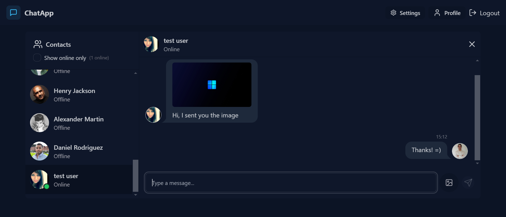

# ChatApp

Realtime M.E.R.N Chat App

## Tech Stack

React.Js, Node.Js, Express.js, MongoDB, Socket.IO, JWT Auth, Zustand, Tailwindcss, DaisyUI.

## Features

📨 Realtime messages with Socket.IO

🟢 Show Online/Offline Users

🔐 Client and Server Validations

🗂️ Image Upload with Cloudinary

🎨 Styling with Tailwindcss and DaisyUI

😶‍🌫️ Deployment to Render

- Performance Optimized

## Live Demo

https://chatapp-qhci.onrender.com

## Usage/Examples

